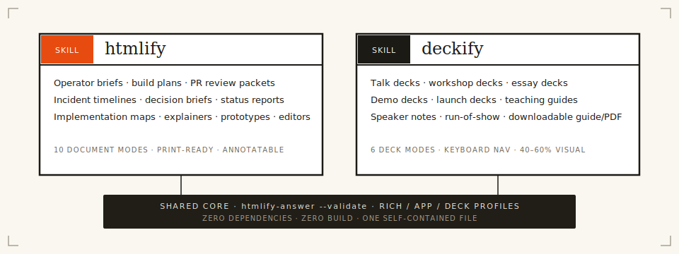
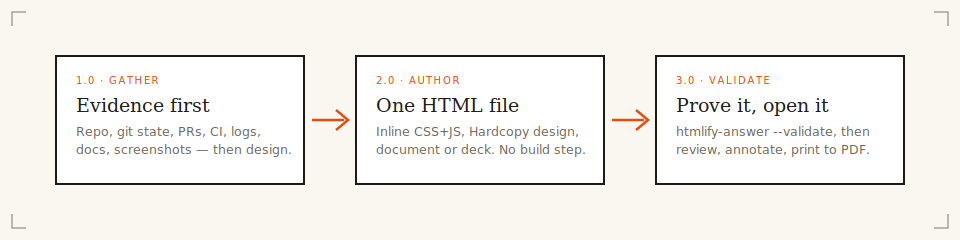

<p align="center">
  
</p>

<h1 align="center">htmlify</h1>

<p align="center"><strong>stdout, made permanent.</strong><br />
Agent answers become self-contained HTML documents and presentation decks — one file you can open, print, annotate, and keep.</p>

<p align="center">
  <a href="https://github.com/zakelfassi/htmlify/actions/workflows/ci.yml"></a>
  <a href="https://www.npmjs.com/package/@zakelfassi/htmlify"></a>
  <a href="./LICENSE"></a>
  <a href="https://zakelfassi.github.io/htmlify/"></a>
</p>

<p>
  
</p>

Coding agents answer in walls of markdown. When the answer has *shape* — a comparison, an architecture, a timeline, a review — that wall flattens it. **htmlify** is a skill family that makes agents ship designed, self-contained HTML instead: operator briefs, PR review packets, incident timelines, decision briefs, explainers, interactive boards, and full presentation decks with speaker notes. Zero dependencies, zero build step, one auditable file.

**See it live: [the gallery](https://zakelfassi.github.io/htmlify/)** — every artifact there was generated by these skills, about this repository.

## What's in the box

| Piece | What it is |
| --- | --- |
| [`skills/htmlify`](skills/htmlify/SKILL.md) | Document skill — 10 modes: operator-brief, build-plan, implementation-map, pr-review-packet, release-brief, incident-report, decision-brief, status-report, explainer, prototype/editor |
| [`skills/deckify`](skills/deckify/SKILL.md) | Deck skill — 6 modes: talk-deck, workshop-deck, essay-deck, demo-deck, launch-deck, teaching-guide; speaker notes, run-of-show, downloadable guide/PDF |
| `htmlify-answer` CLI | Pipe any text into a designed artifact; **validate** any artifact against the rich/app/deck safety profiles |
| Pi / OMP extension | `/htmlify` commands, render modes, browser annotation layer |
| Claude Code plugin | One-command install of both skills, optional long-answer Stop hook |
| [Hardcopy](skills/htmlify/references/hardcopy.md) | The design system every artifact ships in — engineering-plate language: warm paper, ink hairlines, serif display, mono metadata, one signal-orange accent |

<p>
  
</p>

## Install

| Agent | Install |
| --- | --- |
| **Claude Code** | `/plugin marketplace add zakelfassi/htmlify` then `/plugin install htmlify@htmlify` |
| **Codex** | `git clone https://github.com/zakelfassi/htmlify.git ~/.htmlify && ln -sfn ~/.htmlify/skills/htmlify ~/.codex/skills/htmlify && ln -sfn ~/.htmlify/skills/deckify ~/.codex/skills/deckify` |
| **Cursor / Windsurf** | Clone the repo, point a project rule at `skills/htmlify/SKILL.md` / `skills/deckify/SKILL.md` |
| **Aider / anything** | `printf '%s' "$ANSWER" \| npx -y @zakelfassi/htmlify htmlify-answer --title "Review"` |
| **Pi / Oh-My-Pi** | `pi install npm:@zakelfassi/htmlify` |

Per-agent recipes, project rules, and hook setup: [agent-integrations.md](skills/htmlify/references/agent-integrations.md).

## How it works

<p>
  
</p>

1. **Evidence first.** The skill reads the repo, git state, PRs, CI, and logs before designing anything; unverifiable claims are stamped `needs verification`.
2. **One HTML file.** Inline CSS+JS in the Hardcopy design language. No CDNs, no fonts, no analytics, no build.
3. **Prove it.** The bundled validator gates the output — then it opens in your browser.

```bash
npx -y @zakelfassi/htmlify htmlify-answer --validate artifact.html --profile auto
```

| Profile | Rules |
| --- | --- |
| `rich` | No scripts at all — for model-generated documents |
| `app` | Inline scripts allowed (editors, boards); external scripts, `on*=` handlers, `javascript:` URLs still banned |
| `deck` | `app` plus the deck contract: ≥2 slides, keyboard nav, speaker notes on substantive slides, print CSS |
| `auto` | Detected per file from the document shape |

Exit codes: `0` valid · `1` validation errors · `2` usage/IO. Add `--format json` for agent consumption.

## Artifact modes

| Mode | Use when | Live example |
| --- | --- | --- |
| `operator-brief` | What happened, what's next, risks, attention | [operator-brief](https://zakelfassi.github.io/htmlify/examples/htmlify/operator-brief.html) |
| `pr-review-packet` | Motivation, diff tour, reviewer checklist | [PR #1 packet](https://zakelfassi.github.io/htmlify/examples/htmlify/pr-review-packet.html) |
| `incident-report` | Impact, timeline, root cause, follow-ups | [capture bug](https://zakelfassi.github.io/htmlify/examples/htmlify/incident-timeline.html) |
| `decision-brief` | Options, tradeoffs, the call | [monorepo decision](https://zakelfassi.github.io/htmlify/examples/htmlify/decision-brief.html) |
| `implementation-map` | Modules, data flow, hot path | [runtime map](https://zakelfassi.github.io/htmlify/examples/htmlify/implementation-map.html) |
| `explainer` | Concepts, comparisons, glossary, FAQ | [HTML vs markdown](https://zakelfassi.github.io/htmlify/examples/htmlify/explainer.html) |
| `prototype` / `editor` | Interactive triage, tuning, ordering — with export | [launch board](https://zakelfassi.github.io/htmlify/examples/htmlify/launch-board.html) |
| `talk-deck` (deckify) | Talks with speaker notes + run-of-show | [launch talk](https://zakelfassi.github.io/htmlify/examples/deckify/talk-deck.html) |
| `workshop-deck` (deckify) | Teaching with exercises + printable guide | [skill workshop](https://zakelfassi.github.io/htmlify/examples/deckify/workshop-deck.html) |

Plus `build-plan`, `release-brief`, `status-report`, and deckify's `essay-deck`, `demo-deck`, `launch-deck`, `teaching-guide`.

## The Pi / OMP runtime (optional)

The npm package doubles as a Pi / Oh-My-Pi extension that captures long answers and exports them on demand:

| Command | Result |
| --- | --- |
| `/htmlify` | Quick local HTML of the last long answer (Hardcopy-styled, outline rail, annotation layer) |
| `/htmlify choose` | Render-mode chooser — `local`, `pi` (current model second pass), `gemini` (Gemini CLI, falls back to local) |
| `/htmlify-comments <json>` | Import browser review comments back to the agent as a structured prompt |
| `/htmlify-version` | Show loaded version |

Legacy aliases (`/html-last`, `/html-comments`, `/html-last-version`) keep working. Exports include a trusted annotation layer: select text in the browser, comment, copy Markdown for the agent, or download a JSON bundle. Long answers stay visible in the terminal — export is always explicit.

For agents with hooks, the bundled Claude Code Stop hook archives answers past a threshold (`HTMLIFY_MIN_CHARS`, default 2500) to `HTMLIFY_EXPORT_ROOT` — opt-in, see [agent-integrations.md](skills/htmlify/references/agent-integrations.md).

## Migrating from 0.x

1.0 restructures the repo into a skill family. **Breaking:** the root `SKILL.md` and `references/` moved to `skills/htmlify/`; clones installed as a skill directory at the repo root must re-install:

```bash
ln -sfn /path/to/htmlify/skills/htmlify ~/.codex/skills/htmlify   # and skills/deckify
```

Unchanged: the `htmlify-answer` CLI flags and stdin behavior (`--validate` is additive), the hook path `hooks/claude-code-stop-htmlify.js` (existing `settings.json` entries keep working), the Pi/OMP entry points, all `/htmlify` commands, and the env vars (including the legacy `PI_HTML_LONG_ANSWER_*` aliases).

## Development

```bash
corepack enable && pnpm install
pnpm test        # node --test, 35 tests
pnpm lint        # biome
pnpm typecheck   # strict tsc over JSDoc types
node bin/htmlify-answer.js --validate examples/htmlify/*.html examples/deckify/*.html --profile auto
```

The runtime is dependency-free CommonJS under `src/` with strict JSDoc type checking — what ships is what you read. Releases are cut by [release-please](https://github.com/googleapis/release-please) from conventional commits, published to npm with provenance. See [CONTRIBUTING.md](CONTRIBUTING.md).

## Trust and security

Extensions and hooks run with your user permissions — install from sources you trust and pin a ref when you need reproducibility. Model-generated HTML is treated as untrusted until validated: scripts (in the `rich` profile), event-handler attributes, `javascript:` URLs, external assets/CSS, meta refresh, and oversized output are rejected, with fallback to the local renderer. Interactive profiles still ban every external-execution vector. Found a way around the validator? That's a security report we want: [SECURITY.md](SECURITY.md).

## License

[Apache-2.0](LICENSE) © Zak El Fassi
