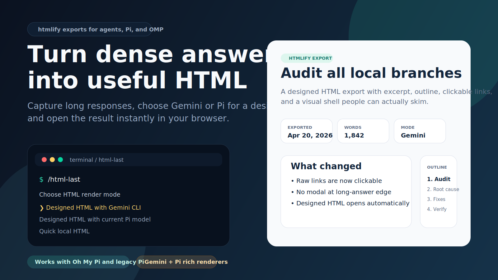

# htmlify

Turn long agent answers into self-contained HTML artifacts people can scan, discuss, annotate, and ship.

<p>
  
</p>

## What It Is

htmlify is both:

- a Pi / Oh My Pi extension for exporting long assistant replies as local HTML
- an agentskills.io-compatible skill for asking coding agents to produce useful single-file HTML briefs, maps, reviews, reports, explainers, and lightweight editors

It merges three ideas:

- Long answers should stay visible in the terminal until the user explicitly exports them.
- HTML beats markdown when the work is spatial, comparative, interactive, or meeting-facing.
- Operator artifacts should be evidence-first, visual, self-contained, and production-safe.

## Skill Install

This repository root is a valid Agent Skill directory because it contains `SKILL.md`.

```bash
mkdir -p ~/.codex/skills
git clone https://github.com/zakelfassi/htmlify.git ~/.codex/skills/htmlify
```

For other clients that support the agentskills.io format, install or copy this folder into that client's skills directory. The required skill entrypoint is:

```text
htmlify/SKILL.md
```

The skill uses progressive disclosure: `SKILL.md` is the activation surface, and `references/htmlify-principles.md` is loaded only when deeper artifact guidance is needed.

## Extension Install

Native Pi npm install:

```bash
pi install npm:@zakelfassi/htmlify
```

Native Pi git install:

```bash
pi install git:https://github.com/zakelfassi/htmlify.git
```

Oh My Pi / OMP global install:

```bash
mkdir -p ~/.omp/agent/extensions
git clone https://github.com/zakelfassi/htmlify.git ~/.omp/agent/extensions/htmlify
```

Then ask for a long answer and run:

```text
/htmlify-version
/htmlify local
```

Legacy command aliases remain available: `/html-last`, `/html-last-version`, and `/html-comments`.

## Render Modes

<p>
  
</p>

| Mode | What it does | Best for |
|---|---|---|
| `local` | Fast local render with a designed shell, outline rail, excerpt hero, and clickable links | Speed and reliability |
| `pi` | Uses the current Pi model for a richer second-pass HTML render | Staying in the current session/model context |
| `gemini` | Uses Gemini CLI for a richer external render; falls back to local HTML if valid HTML is not returned | Maximum polish when Gemini is available |

## Commands

| Command | Result |
|---|---|
| `/htmlify` | Opens quick local HTML without starting a Pi model turn |
| `/htmlify choose` | Opens a render-mode chooser |
| `/htmlify local` | Forces quick local HTML |
| `/htmlify pi` | Forces designed HTML via the current Pi model |
| `/htmlify gemini` | Forces designed HTML via Gemini CLI |
| `/htmlify-version` | Shows the loaded extension version |
| `/htmlify-comments <comments.json>` | Imports downloaded HTML review comments and sends them back to the current agent |

## Runtime Behavior

<p>
  
</p>

- Long answers are detected from message length, line count, or paragraph count.
- Long answers are captured into session state so export commands can work after the answer finishes.
- Local and designed exports open automatically in the browser after the file is written.
- Exports include a trusted local annotation layer: highlight text, add comments, copy Markdown for the agent, or download a comments JSON bundle.
- Rich Pi/Gemini renders must be standalone HTML documents with inline CSS only.
- Rich HTML is validated before writing: scripts, event-handler attributes, `javascript:` URLs, external assets, external CSS URLs, unsafe tags, oversized output, and overly complex output are rejected or routed to fallback behavior.

## Repo Layout

```text
htmlify/
├── .github/workflows/ci.yml
├── assets/
├── references/
│   └── htmlify-principles.md
├── test/
│   └── extension.test.js
├── index.js
├── package.json
├── pnpm-lock.yaml
├── README.md
└── SKILL.md
```

## Development

Use PNPM:

```bash
pnpm install
pnpm test
```

If you modify the runtime, re-test these flows:

- long answer -> answer remains visible; no automatic replacement notice appears
- `/htmlify` -> local HTML writes and opens without starting a Pi model turn
- `/htmlify choose` -> chooser appears when supported
- `/htmlify pi` -> second-pass render path queues/runs and validates rich HTML
- `/htmlify gemini` -> Gemini render path succeeds or cleanly falls back
- `/htmlify-comments <comments.json>` -> browser comments validate and queue a structured review prompt
- `/htmlify-version` -> version shown in-session

## Publishing

The unscoped npm name `htmlify` is already taken. Publish this package under the scoped name:

```bash
NPM_CONFIG_CACHE=/private/tmp/htmlify-npm-cache npm publish --access public
```

## Trust And Security

Extensions run with your user permissions. Only install from sources you trust, review the source before installing, and pin a git ref or tag when you need reproducible behavior.

Rich HTML generated by Pi or Gemini is treated as untrusted until it passes validation. The validator is intentionally conservative: if rich output includes active scripts, event handlers, external assets, or unsafe URLs, htmlify falls back to local HTML rather than writing the rich document.
